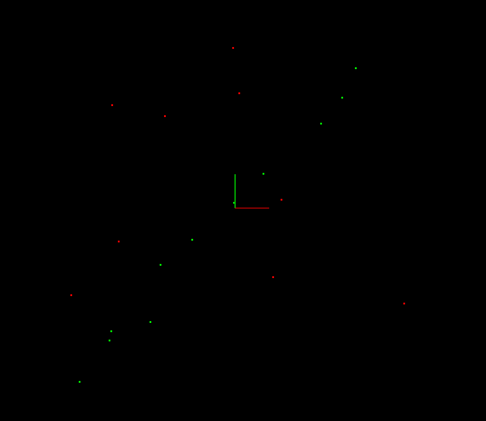
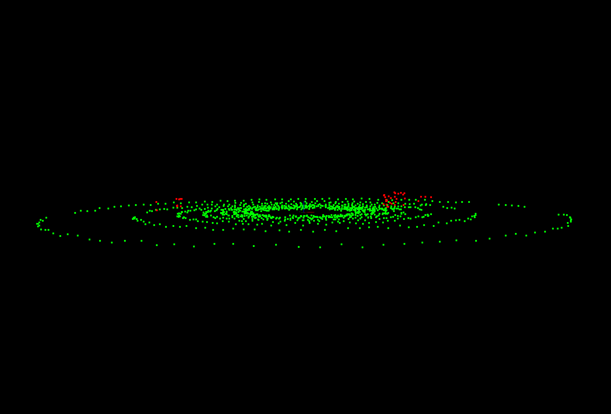
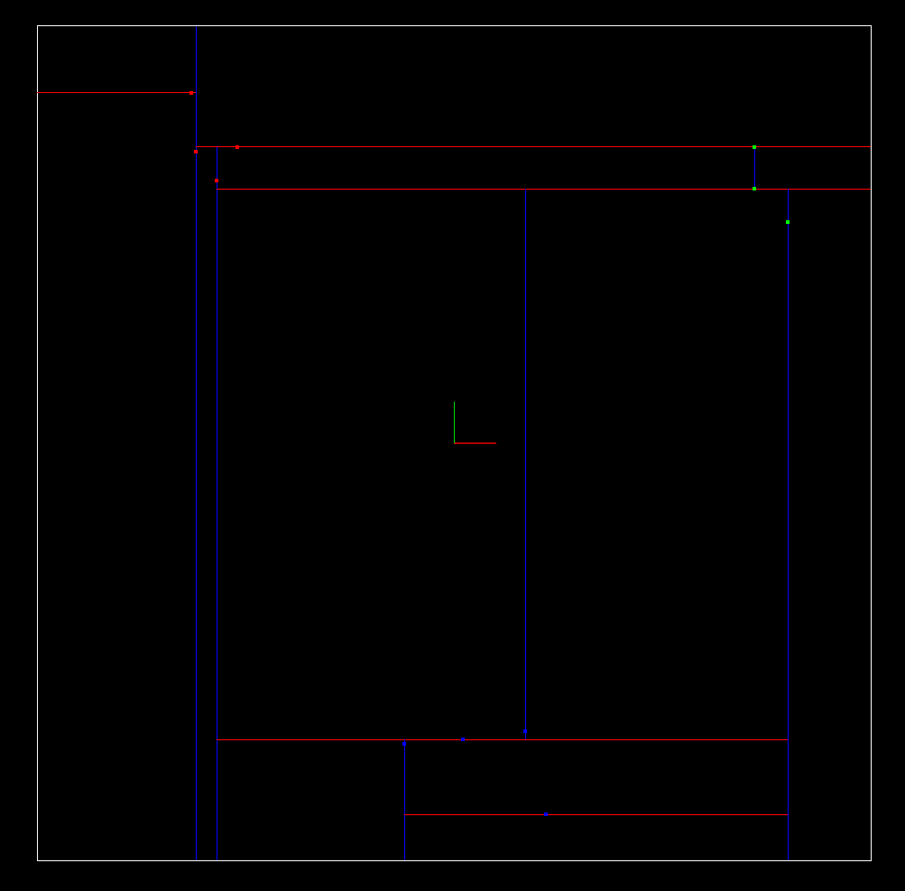

# UdacitySensorFusion
Course metrials and projects of Udacity Sensor Fusion Nanodegree Program.
 

## Lidar Obstacle Detection

* Contained in the folder [lidar_obstacle_detection](lidar_obstacle_detection/)
* Implemented a 3D lidar object detection, which contains several classical algoirthm:
    * Raw Lidar Point Clouds rendering: check the [top left gif](lidar_obstacle_detection/media/process-lidar-raw.gif)
    * Processed result rendering with bounding boxes: check the [top right gif](lidar_obstacle_detection/media/process-lidar-bbox.gif)
    * Lidar point clouds **segmentation** using the [RANSAC](lidar_obstacle_detection/src/quiz/ransac/) technique ([Wiki page](https://en.wikipedia.org/wiki/Random_sample_consensus))
    * Lidar point clouds **clustering** using [kd-tree](lidar_obstacle_detection/src/quiz/cluster/) algorithm ([Wiki page](https://en.wikipedia.org/wiki/K-d_tree))

| Type |  RANSAC 2D Line Fitting   | RANSAC 3D Plane Fitting | Kd-tree Clustering | 
| --- | --- | --- | --- |
| Result |   |  |  |
| Source code | [RANSAC 2D source code](lidar_obstacle_detection/src/quiz/ransac/ransac2d.cpp) | [RANSAC 3D source code](lidar_obstacle_detection/src/quiz/ransac/ransac3d.cpp) | [Kd-tree source code](lidar_obstacle_detection/src/quiz/cluster/kdtree.h) |

## Camera
* On-going
## Radar
* On-going